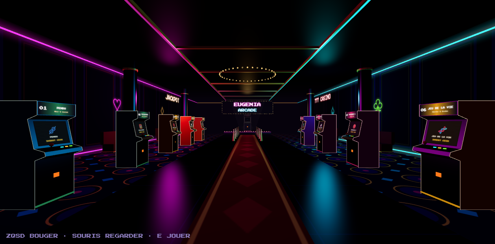

# projet_python_space_invaders

**Space Invaders en Python pur**, jouable sur une borne dans une **salle d'arcade 3D**.
Projet 10 de l'atelier « 10 projets, à vous de jouer » — Eugenia School, Bachelor 2 — Corentin & Maxim.



## Lancer

Rien à installer à part Python 3.11+ (aucune dépendance, pas de npm) :

```powershell
python main.py
```

Le navigateur s'ouvre sur `http://localhost:8000`. Clique pour entrer, avance jusqu'à la borne 10 au bout du tapis rouge et appuie sur **E**.
Lien direct vers la borne : `http://localhost:8000/#jeu`.

| Touche | Salle | Borne |
|---|---|---|
| ZQSD + souris | se déplacer, regarder | |
| Maj | courir | |
| E | jouer / lancer le projet de la borne visée | |
| ← → | | déplacer le vaisseau |
| Espace | | tirer, démarrer, rejouer |
| P | | pause |
| Échap | | revenir dans la salle |

## Le jeu en Python pur : 4 fichiers

C'est le **10e jeu** de la salle : toute sa logique est dans `projets/projet_10_space_invaders/space_invaders/`, écrite **uniquement avec les notions du cours**
(variables, conditions, boucles, fonctions, listes/dictionnaires, modules et packages, classes, `@property`, héritage, composition, `random`).

```
niveaux.py  ←  entites.py  ←  flotte.py  ←  partie.py
```

| Fichier | Rôle | Notions du cours montrées |
|---|---|---|
| `niveaux.py` | constantes, canons de chaque vaisseau, les 5 paliers | dictionnaires, liste de dictionnaires, fonction + `return` |
| `entites.py` | `Entite` → `Vaisseau`, `Missile`, `Ennemi` | classes, héritage, `super()`, `@property` + setter + `raise ValueError` |
| `flotte.py` | la grille d'ennemis : avance, rebondit, descend, riposte | composition, boucles imbriquées, `random` |
| `partie.py` | assemble tout : tirs, collisions, score, vies, vagues, paliers | composition, `from ... import` |
| `../main.py` | lance une partie de démonstration sans affichage | `import`, `if __name__ == "__main__"` |

Le moteur tourne aussi sans aucun affichage : `cd projets/projet_10_space_invaders` puis `python main.py`.

### Règles

- 3 vies, score et meilleur score affichés.
- Quand la flotte est détruite, une nouvelle vague arrive, un peu plus rapide.
- **Paliers** selon le nombre d'ennemis tués (0, 20, 50, 100, 170) : le vaisseau se transforme
  (chasseur → intercepteur → faucon → croiseur → dreadnought) et tire 1, 2, 3, 4 puis 5 missiles à la fois
  et il gagne une vie ; les vagues suivantes ont plus d'ennemis, plus rapides, qui tirent plus souvent.
- Défaite à 0 vie ou si les envahisseurs arrivent en bas.

## Architecture

```
main.py → lanceur/serveur.py (Python, bibliothèque standard)
            ├─ fait tourner Partie() 60 fois par seconde
            ├─ envoie l'état du jeu au navigateur (/api/flux)
            ├─ reçoit les touches (/api/touches, /api/pause)
            └─ ouvre un terminal pour les projets 1 à 9 (/api/lancer/<n>)
salle/ (navigateur) : index.html + salle.js (salle 3D) + jeu.js (dessin du jeu) + lib/ (Three.js et police, en local)
```

Le navigateur **n'a aucune règle du jeu** : il dessine ce que Python lui envoie et lui transmet les touches.

## Brancher un autre projet

Voir [`projets/LISEZ_MOI.md`](projets/LISEZ_MOI.md) : un dossier `projets/projet_XX_nom/` avec un `main.py` (comme `projet_10_space_invaders/`),
puis `"disponible": true` dans `projets/projets.json`.

## Tests

```powershell
python -m venv .venv
.\.venv\Scripts\Activate.ps1
pip install -e ".[dev]"
pytest
python outils/verifier_notions.py
```

`outils/verifier_notions.py` vérifie que les 4 fichiers n'utilisent aucune notion hors cours.
